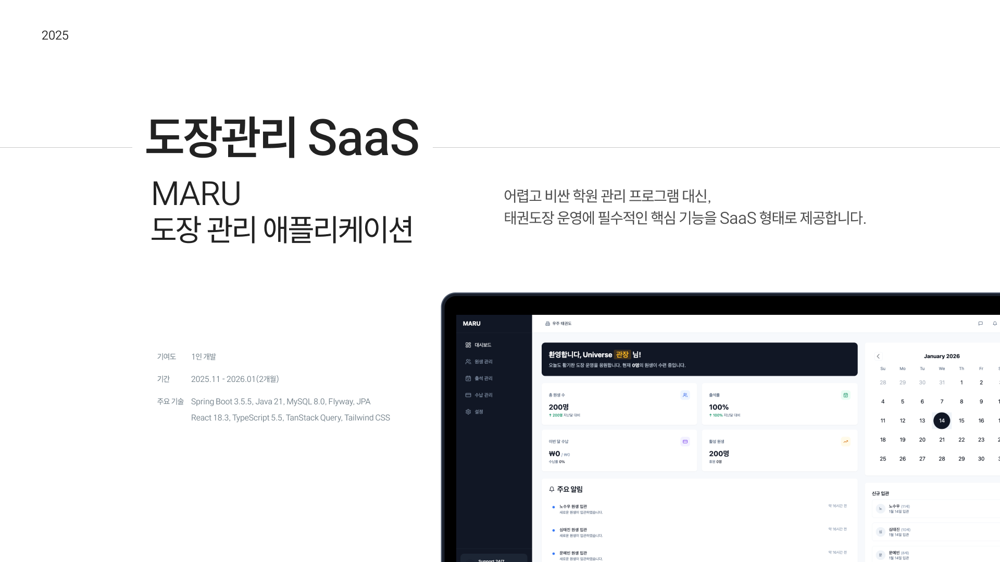
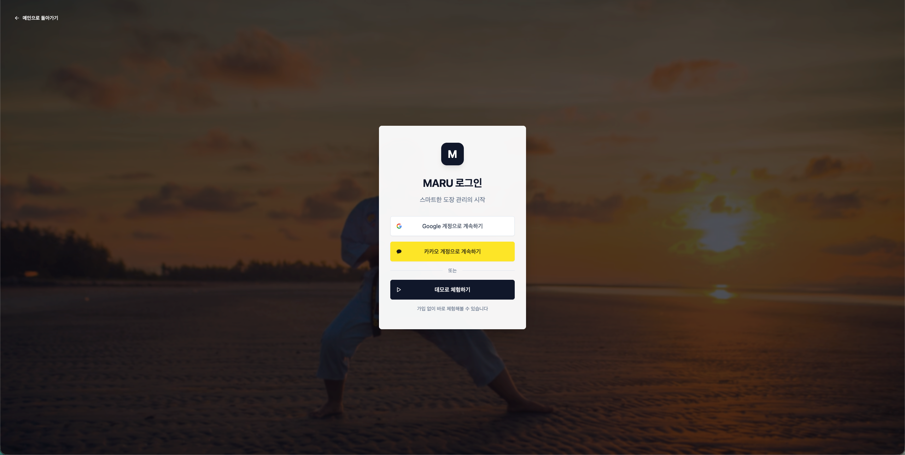
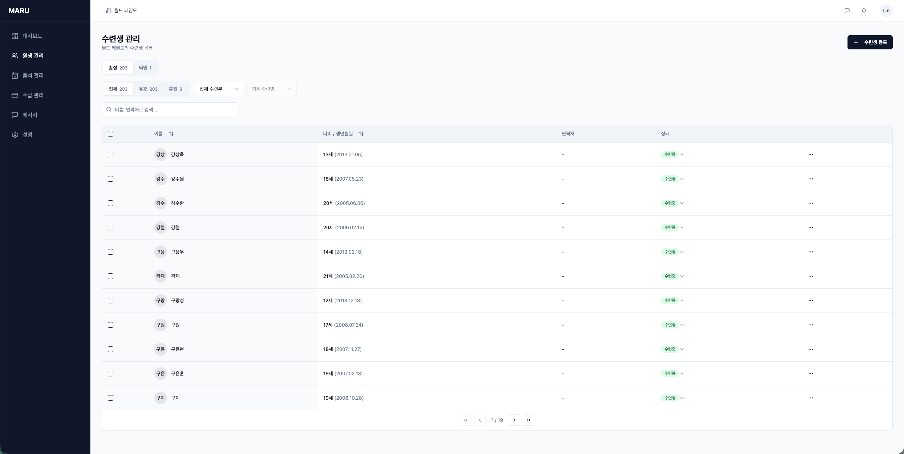
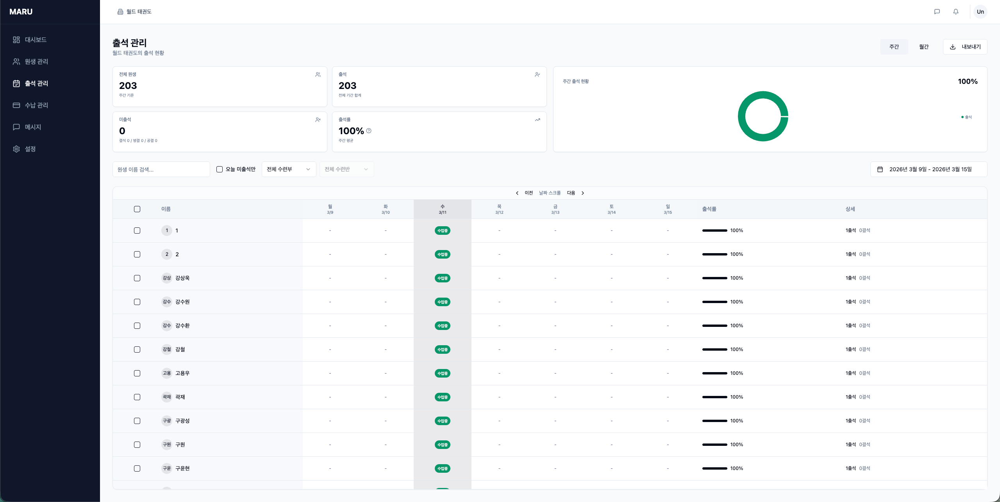
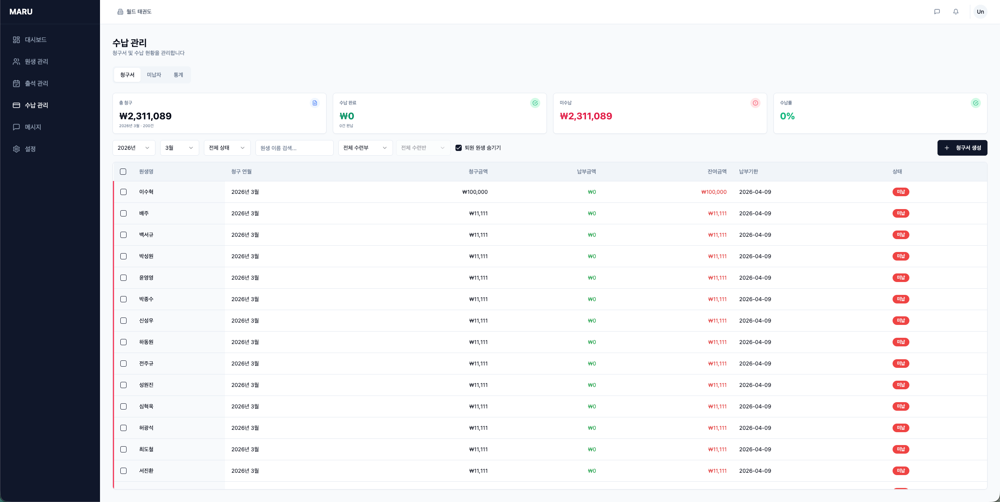
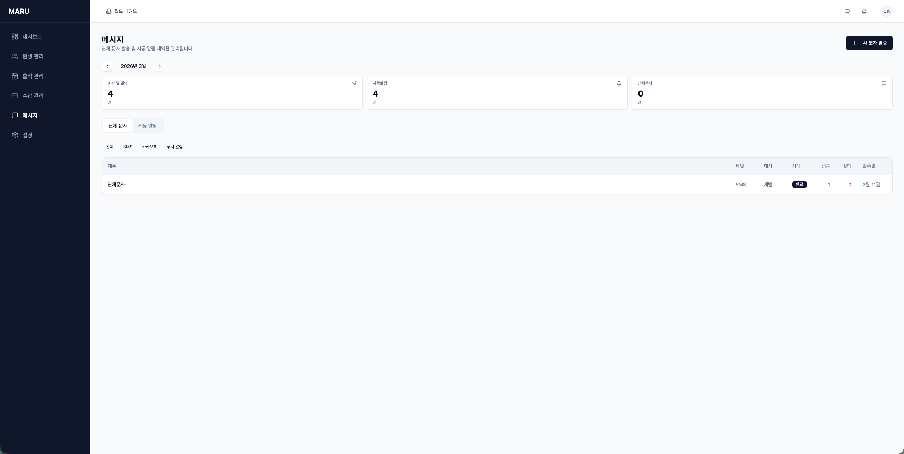
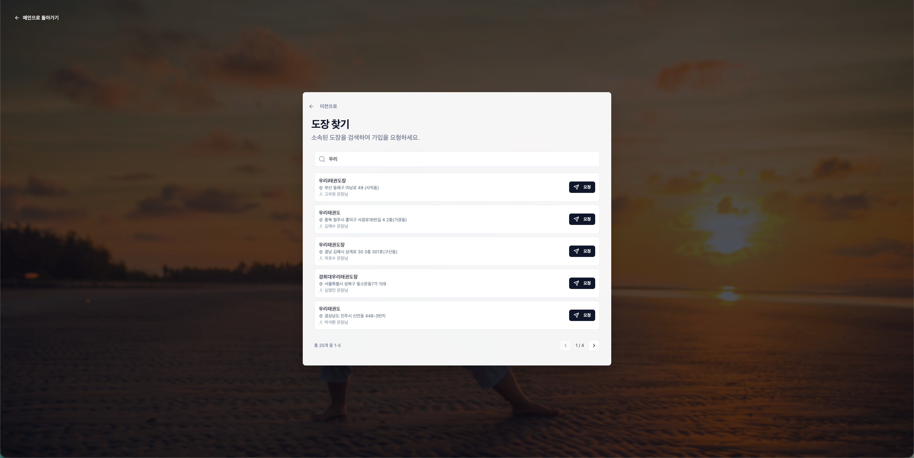

<div align="center">



# 마루 - 태권도장 관리 플랫폼

**중소 규모 태권도장을 위한 출결 · 수납 · 원생 관리 SaaS**

[](https://spring.io/projects/spring-boot)
[](https://openjdk.org/)
[](https://react.dev/)
[](https://www.typescriptlang.org/)
[](https://www.mysql.com/)
[](https://aws.amazon.com/)

[직접 체험하기](https://www.maru-tkd.store/) · [API 명세서](https://api.maru-tkd.store/api/docs.html) · [Wiki 문서](https://github.com/f-lab-edu/maru-management-app/wiki)

</div>

---

## 프로젝트 소개

기존 회원 관리 플랫폼들은 대형 입시 학원을 타겟으로 설계되어, 중소규모 태권도장에는 **불필요한 복잡성**과 **높은 진입 장벽**이 존재했습니다.

이전 직장에서 태권도장 관리 서비스를 운영하며 도메인 전문성을 쌓았고, 레거시 아키텍처의 확장성 한계와 기술 부채를 직접 경험했습니다.<br>
**마루**는 해당 경험을 바탕으로 처음부터 새로 설계·구현한 프로젝트로, 현장의 페인포인트를 해결하면서 **신뢰성과 견고함을 갖춘 SaaS 아키텍처**를 목표로 합니다.

### 주요 기능

| 기능 | 설명 |
|------|------|
| **OAuth 소셜 로그인** | Kakao / Google 로그인 + JWT (httpOnly Cookie) |
| **멀티테넌시** | Tenant → Dojang 계층 구조, 테넌트 간 데이터 격리 |
| **원생 관리** | CRUD, 상태 관리, 학부모 연동 |
| **출결 관리** | 수동/일괄 출석, 자동 결석 처리 |
| **수납 관리** | 청구서 발행, 부분 납부, 자동 발행 |
| **PG 결제** | 토스페이먼츠 연동, 결제 링크 SMS 발송, 환불 |
| **SMS 알림** | 출결/퇴관 알림, 단체 문자 발송 |
| **도장 검색** | 초성/이름/주소 검색 (자체 검색 엔진) |
| **대시보드** | 출석/수납 현황, 통계 차트 |


### 서비스 사진

<details>
<summary>
소셜 로그인
</summary>



</details>

<details>
<summary>
원생 관리
</summary>



</details>

<details>
<summary>
출결 관리
</summary>



</details>

<details>
<summary>
수납 관리
</summary>



</details>

<details>
<summary>
메시지
</summary>



</details>

<details>
<summary>
도장 검색
</summary>



</details>


## 시스템 아키텍처

<div align="center">


</div>

CloudFront를 통한 정적 자산 CDN 배포, EC2 단일 인스턴스 기반 API 서버 구성. <br>
SSM을 통한 Pull 배포로 SSH 포트(22번)를 폐쇄하여 무차별 대입 공격을 차단합니다.

<div align="center">


</div>

GitHub Actions → S3 아티팩트 업로드 → SSM Pull 배포 → 60초 헬스체크 후 실패 시 자동 롤백.

→ [인프라 아키텍처 상세](https://github.com/f-lab-edu/maru-management-app/wiki/인프라-아키텍처) · [CI/CD 전략 상세](https://github.com/f-lab-edu/maru-management-app/wiki/CI-CD-전략)

---

## 핵심 기술적 도전

### 1. 한글 특화 검색 엔진 자체 구현

> **"ㅌㄱㄷ" → "태권도"** 초성 검색을 Elasticsearch 없이 구현

**문제**: MySQL LIKE 검색은 느리고, Full-Text는 초성 미지원, Elasticsearch는 인프라 과도

**해결**:
- 3단계 분석 파이프라인: **Normalize → Segment → Tokenize**
- Bi-gram + 초성 추출 + 접두사/접미사 분리 규칙 기반 토크나이저
- TF-IDF 스코어링 + 인메모리 역인덱스
- `AnalyzerEngine` 빌더 패턴으로 필드별 분석기 커스터마이징
- MatchType 가중치 × IndexField 가중치 × IDF 복합 스코어링

**결과**: 전국 도장 9,400건 기준 25MB 메모리, 검색 응답 0.1~0.3ms로 고성능 한글 검색 실현

→ [상세 설계 문서](https://github.com/f-lab-edu/maru-management-app/wiki/검색-전략) <br>
→ [회고 및 상세 설명](https://velog.io/@cupcakes33/ES-%EC%97%86%EC%9D%B4-%EB%8F%84%EB%A9%94%EC%9D%B8-%ED%8A%B9%ED%99%94-%EA%B2%80%EC%83%89-%EC%97%94%EC%A7%84-%EA%B5%AC%ED%98%84%ED%95%98%EA%B8%B0)


---

### 2. DB 기반 Message Dispatch 시스템

> 인프라 의존 없이 **메시지 유실 0%** 달성

**문제**: 출결 알림 SMS를 비즈니스 트랜잭션과 분리하면서 신뢰성 확보 필요. RabbitMQ/Kafka는 초기 서비스에 과도

**해결**:
- DB Polling 기반 비동기 메시지 큐 + MessageDispatchWorker
- 3계층 데이터 모델: **Broadcast → Dispatch → Attempt**
- 네이티브 쿼리 배치 선점으로 중복 발송 방지
- 지수 백오프(30s→3600s) + ±20% Jitter 재시도, Stuck 복구 스케줄러
- 채널 어댑터 패턴 (SMS / Kakao / Push 확장 가능)

**결과**: 피크타임 47건/초 처리, DB 커넥션 풀 1개로 충분, 메시지 유실 0%

→ [상세 설계 문서](https://github.com/f-lab-edu/maru-management-app/wiki/메시지-디스패치-전략)<br>
→ [회고 및 상세설명](https://velog.io/@cupcakes33/DB-%EA%B8%B0%EB%B0%98-%EB%B9%84%EB%8F%99%EA%B8%B0-%EB%A9%94%EC%8B%9C%EC%A7%80-%EB%94%94%EC%8A%A4%ED%8C%A8%EC%B3%90-%EC%84%A4%EA%B3%84%ED%95%98%EA%B8%B0)


---

### 3. 결제 도메인 안전성 설계

> PG 결제의 **멱등성, 동시성, 보상 트랜잭션**을 보장하는 설계

**문제**: PG 결제의 멱등성, 동시 결제 방지, 트랜잭션 롤백 시 보상 처리 필요

**해결**:
- Invoice / Payment / PgPayment / Refund **독립 도메인** 분리
- `paymentKey` 기반 멱등성 보장
- `REQUIRES_NEW` 독립 트랜잭션으로 PG 상태 우선 저장
- `AFTER_ROLLBACK` 보상 트랜잭션으로 실패 시 자동 PG 취소
- `SELECT FOR UPDATE` 비관적 락으로 동시 결제 방지

**결과**: 동시 결제 요청 시 중복 승인 0건, 트랜잭션 롤백 시 PG 자동 취소로 고아 결제 방지

→ [상세 설계 문서](https://github.com/f-lab-edu/maru-management-app/wiki/pg-payments)<br>
→ [회고 및 상세설명](https://velog.io/@cupcakes33/%EA%B2%B0%EC%A0%9C-%EC%8B%9C%EC%8A%A4%ED%85%9C%EC%97%90%EC%84%9C-%EC%8B%A4%ED%8C%A8%EB%A5%BC-%EC%84%A4%EA%B3%84%ED%95%9C%EB%8B%A4%EB%8A%94-%EA%B2%83)

---

### 4. ThreadLocal + AOP 멀티테넌시 보안 체계

> 모든 API 요청마다 최대 **5회 DB 조회**를 Caffeine Cache로 최적화

**문제**: 여러 도장이 같은 DB를 공유하면서 데이터 혼선 방지 및 인증/인가 성능 확보 필요

**해결**:
- 4단계 인증/인가 파이프라인: **JWT Filter → Dojang Access AOP → Permission Check AOP → Query Filtering**
- Caffeine Cache 5종으로 DB 조회 최소화 (TTL 30분, 최대 10,000건)
- 인터페이스 기반 캐시 추상화 (Redis 교체 용이)

**결과**: 요청당 최대 5회 DB 조회 → 캐시 히트 시 0회로 감소

→ [상세 설계 문서](https://github.com/f-lab-edu/maru-management-app/wiki/인증-인가-전략)

---

### 5. Pull 기반 배포 + 자동 롤백

> SSH 포트 개방 없이 **60초 헬스체크 후 자동 롤백**

**문제**: SSH 포트 개방은 보안 위험, 배포 실패 시 수동 롤백 필요

**해결**:
- S3 + SSM 기반 Pull 배포 (22번 포트 폐쇄)
- 원자적 교체 (`mv`) 로 다운타임 최소화
- 60초 헬스체크 후 실패 시 자동 롤백

**결과**: SSH 무차별 대입 공격 원천 차단, 배포 실패 시 60초 내 자동 복구

→ [상세 설계 문서](https://github.com/f-lab-edu/maru-management-app/wiki/CI-CD-전략)

---

## 기술 스택

### Backend

| 기술 | 활용 |
|------|------|
| **Java 21 + Spring Boot 3.5** | Virtual Thread 지원, 최신 LTS 기반 |
| **Spring Security + JWT** | httpOnly Cookie 인증, OAuth 소셜 로그인 (Kakao/Google) |
| **Spring Data JPA + Flyway** | 형상 관리 수준의 스키마 마이그레이션 |
| **Caffeine Cache** | 요청당 5회 DB 조회 → 0회 최적화 (인터페이스 추상화로 Redis 교체 가능) |
| **토스페이먼츠 REST API** | PG 결제 승인, 서브몰, 환불 |
| **Solapi SMS** | 출결/퇴관 알림, 단체 문자 발송 |
| **SpringDoc OpenAPI** | API 문서 자동화 + JavaDoc 연동 |

### Frontend

| 기술 | 활용 |
|------|------|
| **React 18 + TypeScript 5.5** | SPA 구현, 타입 안전성 |
| **TanStack Query + Zustand** | 서버/클라이언트 상태 분리 |
| **Tailwind CSS + shadcn/ui** | 커스터마이징 가능한 디자인 시스템 |
| **React Hook Form + Zod** | 폼 관리 + 런타임 스키마 검증 |
| **TanStack Table + Recharts** | 데이터 테이블, 통계 차트 |
| **@tosspayments/tosspayments-sdk** | PG 결제 UI 연동 |

### Infrastructure

| 기술 | 활용 |
|------|------|
| **AWS EC2 + S3 + CloudFront** | 서버 운영 + 정적 자산 CDN 배포 |
| **AWS SSM** | SSH 없는 Pull 기반 배포 (22번 포트 폐쇄) |
| **GitHub Actions** | CI/CD 파이프라인 |
| **Flyway** | DB 마이그레이션 형상 관리 |

### 핵심 기술 의사결정

| 결정 | 선택 | 대안 | 선택 이유 |
|------|------|------|-----------|
| 검색 | 자체 구현 역인덱스 | Elasticsearch, MySQL Full-Text | 한글 특화(초성 검색), 인프라 단순, 도메인 최적화 |
| 메시징 | DB 기반 Message Dispatch | RabbitMQ, Kafka | 인프라 비용/복잡도 최소화, 트랜잭션 보장 |
| 캐시 | Caffeine (로컬) | Redis (분산) | 단일 인스턴스 최적, 인터페이스 추상화로 교체 가능 |
| PK 전략 | TSID (13자) | Auto-Increment, UUID | B-Tree 인덱스 효율, 비예측성(보안), 분산 환경 대응 |

---

<details>
<summary><b>ERD (클릭하여 펼치기)</b></summary>
<br>

<div align="center">


[dbdiagram.io에서 보기](https://dbdiagram.io/d/68c8335c1ff9c616bdc32f52)

</div>

</details>

<details>
<summary><b>프로젝트 구조 (클릭하여 펼치기)</b></summary>
<br>

```
backend/src/main/java/com/maru/
├── common/         # 예외 처리, 유틸리티
├── config/         # Security, CORS, JPA 설정
├── controller/     # REST API + DTO
├── domain/         # JPA Entity, Enum
├── repository/     # Spring Data JPA
├── scheduler/      # 스케줄링 작업
├── security/       # JWT, TenantContextHolder
└── service/        # 비즈니스 로직 + DTO
```

```
frontend/src/
├── components/     # 공통 컴포넌트
├── constants/      # 상수 정의
├── features/       # 기능별 모듈
├── hooks/          # Custom Hooks
├── layouts/        # 레이아웃 컴포넌트
├── lib/            # 유틸리티
├── pages/          # 라우트 페이지
├── router/         # 라우팅 설정
├── services/       # API 호출
├── shared/         # 공유 모듈
├── stores/         # Zustand 상태
├── types/          # TypeScript 타입 정의
└── widgets/        # 위젯 컴포넌트
```

</details>
